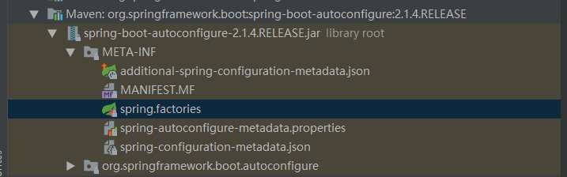
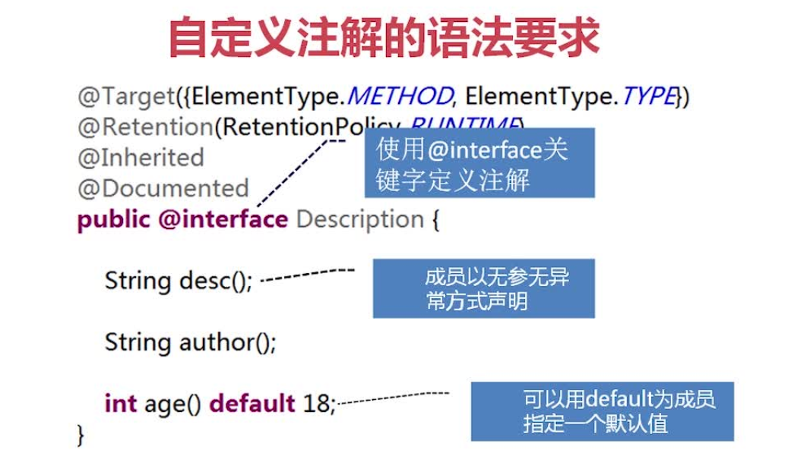
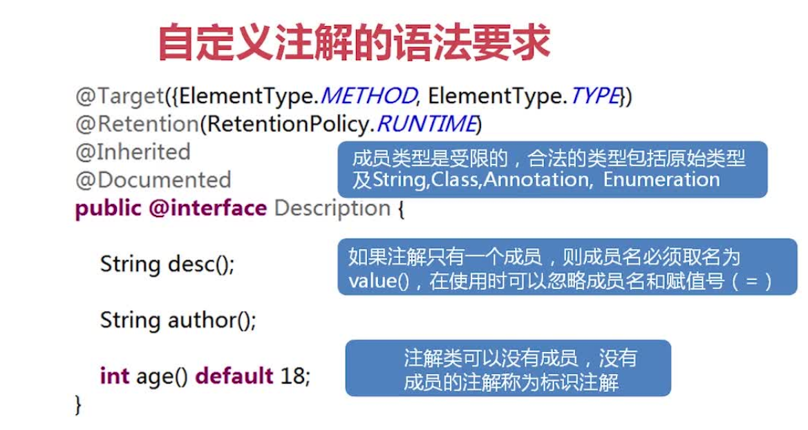

##  为什么要使用SpringBoot?使用SpringBoot的最大好处是什么？
使用SpringBoot的最大好处就是简化配置，它实现了自动化配置。         
这里以SpringBoot 2.1.4.RELEASE版本和Spring 5.1.6.RELEASE版本为例。     
API文档：https://docs.spring.io/spring-boot/docs/current/api/     
自动化配置的原理如下：     
一个SpringBoot构建的项目都会有一个入口启动类，其中有个最重要的注解就是@SpringBootApplication，其源码如下：
```$xslt
@Target({ElementType.TYPE})
@Retention(RetentionPolicy.RUNTIME)
@Documented
@Inherited
@SpringBootConfiguration
@EnableAutoConfiguration
@ComponentScan(
    excludeFilters = {@Filter(
    type = FilterType.CUSTOM,
    classes = {TypeExcludeFilter.class}
), @Filter(
    type = FilterType.CUSTOM,
    classes = {AutoConfigurationExcludeFilter.class}
)}
)
public @interface SpringBootApplication {
    @AliasFor(
        annotation = EnableAutoConfiguration.class
    )
    Class<?>[] exclude() default {};

    @AliasFor(
        annotation = EnableAutoConfiguration.class
    )
    String[] excludeName() default {};

    @AliasFor(
        annotation = ComponentScan.class,
        attribute = "basePackages"
    )
    String[] scanBasePackages() default {};

    @AliasFor(
        annotation = ComponentScan.class,
        attribute = "basePackageClasses"
    )
    Class<?>[] scanBasePackageClasses() default {};
}

```
在SpringBootApplication类上有一个重要的注解@EnableAutoConfiguration，它就是实现自动化配置的核心。当SpringBoot项目启动的时候，就会调用@EnableAutoConfiguration来进一步加载系统所需的一些配置信息，完成自动化配置。    
@EnableAutoConfiguration的源码如下：    
```$xslt
@Target({ElementType.TYPE})
@Retention(RetentionPolicy.RUNTIME)
@Documented
@Inherited
@AutoConfigurationPackage
@Import({AutoConfigurationImportSelector.class})
public @interface EnableAutoConfiguration {
    String ENABLED_OVERRIDE_PROPERTY = "spring.boot.enableautoconfiguration";

    Class<?>[] exclude() default {};

    String[] excludeName() default {};
}
```
在EnableAutoConfiguration类中，它使用@Import注解来导入配置类AutoConfigurationImportSelector。     
使用@Import注解可以导入三种类型的配置类，如下：     
(1)直接导入配置类：@Import({xxxConfiguration.class})      

(2)依据条件选择配置类：@Import({xxxSelector.class})      

(3)动态注册 Bean：@Import({xxxRegistrar.class})      
  
我们进入查看AutoConfigurationImportSelector类的源码，（由于源码太多，在此不再展示），其中用到了一个重要的类SpringFactoriesLoader，该类位于org.springframework.core.io.support包下，
它才是真正加载项目所需要的jar包的类，它主要用于加载 classpath下所有 JAR 文件的 META-INF/spring.factories 文件，并分析出其中定义的工厂类。这些工厂类进而被启动逻辑使用，应用于进一步初始化工作。       
SpringFactoriesLoader类是spring框架自己使用的内部工具类，本身被声明为 final，表示不可以被其他类继承。    
SpringFactoriesLoader类的源码如下：
```java
//
// Source code recreated from a .class file by IntelliJ IDEA
// (powered by Fernflower decompiler)
//

package org.springframework.core.io.support;

import java.io.IOException;
import java.net.URL;
import java.util.ArrayList;
import java.util.Collections;
import java.util.Enumeration;
import java.util.Iterator;
import java.util.List;
import java.util.Map;
import java.util.Properties;
import java.util.Map.Entry;
import org.apache.commons.logging.Log;
import org.apache.commons.logging.LogFactory;
import org.springframework.core.annotation.AnnotationAwareOrderComparator;
import org.springframework.core.io.UrlResource;
import org.springframework.lang.Nullable;
import org.springframework.util.Assert;
import org.springframework.util.ClassUtils;
import org.springframework.util.ConcurrentReferenceHashMap;
import org.springframework.util.LinkedMultiValueMap;
import org.springframework.util.MultiValueMap;
import org.springframework.util.ReflectionUtils;
import org.springframework.util.StringUtils;

/**
 * SpringFactoriesLoader#loadFactories设计用于加载和实例化指定类型的工厂，这些工厂类型的定义
 * 来自classpath中多个JAR包内常量FACTORIES_RESOURCE_LOCATION所指定的那些spring.factories文件。
 * spring.factories文件的格式必须是属性文件格式，每条属性的key必须是接口或者抽象类的全限定名，
 * 而属性值value是一个逗号分割的实现类的名称。
*/
public final class SpringFactoriesLoader {
    /*
    * 要加载的资源路径，该常量定义了该工具类要从每个jar包中提取的工厂类定义属性文件的相对路径
    * 在classpath中的多个JAR中，要扫描的工厂配置文件的在本JAR包中的路径。
    * 实际上，Springboot的每个 autoconfigure包都包含spring.factories这个配置文件。
    */
    public static final String FACTORIES_RESOURCE_LOCATION = "META-INF/spring.factories";
    //日志
    private static final Log logger = LogFactory.getLog(SpringFactoriesLoader.class);
    private static final Map<ClassLoader, MultiValueMap<String, String>> cache = new ConcurrentReferenceHashMap();

    private SpringFactoriesLoader() {
    }

    /**
    * @param factoryClass 工厂所属接口/抽象类全限定名称
    * @param classLoader 所要使用的类加载器
    *                    
    * 该方法会读取classpath上所有的jar包中的所有  META-INF/spring.factories 属性文件，找出其中定义的匹配类型 factoryClass 的工厂类，
    * 然后创建每个工厂类的对象/实例，并返回这些工厂类对象/实例的列表
    */
    public static <T> List<T> loadFactories(Class<T> factoryClass, @Nullable ClassLoader classLoader) {
        Assert.notNull(factoryClass, "'factoryClass' must not be null");
        ClassLoader classLoaderToUse = classLoader;
        if (classLoader == null) {
            classLoaderToUse = SpringFactoriesLoader.class.getClassLoader();
        }

        //加载类型为factoryClass的工厂的名称，其实是一个个的全限定类名，使用指定的classloader：classLoaderToUse
        List<String> factoryNames = loadFactoryNames(factoryClass, classLoaderToUse);
        if (logger.isTraceEnabled()) {
            logger.trace("Loaded [" + factoryClass.getName() + "] names: " + factoryNames);
        }

        List<T> result = new ArrayList(factoryNames.size());
        Iterator var5 = factoryNames.iterator();
        // 实例化所加载的每个工厂类
        while(var5.hasNext()) {
            String factoryName = (String)var5.next();
            result.add(instantiateFactory(factoryName, factoryClass, classLoaderToUse));
        }
        //对工厂类进行排序
        AnnotationAwareOrderComparator.sort(result);
        return result;
    }

    /**
    * 
    * @param factoryClass  工厂所属接口/抽象类全限定名称
    * @param classLoader 类加载器
    * @return 
    * 
    * 该方法会读取classpath上所有的jar包中的所有  META-INF/spring.factories 属性文件，找出其中定义的匹配类型 factoryClass 的工厂类，
    * 然后并返回这些工厂类的名字列表，注意是包含包名的全限定名。
    */
    public static List<String> loadFactoryNames(Class<?> factoryClass, @Nullable ClassLoader classLoader) {
        String factoryClassName = factoryClass.getName();
        // 1. 使用指定的classloader扫描classpath上所有的JAR包中的文件META-INF/spring.factories，加载其中的多值工厂属性定义，使用多值Map的形式返回，
        // 2. 返回多值Map中key为factoryClassName的工厂名称列表，如果没有相应的entry，返回空列表而不是返回null
        return (List)loadSpringFactories(classLoader).getOrDefault(factoryClassName, Collections.emptyList());
    }

    /**
    * @param classLoader 类加载器
    *
    * 使用指定的classloader扫描classpath上所有的JAR包中的文件META-INF/spring.factories，加载其中的多值
    * 工厂属性定义，使用多值Map的形式返回
    **/
    private static Map<String, List<String>> loadSpringFactories(@Nullable ClassLoader classLoader) {
        MultiValueMap<String, String> result = (MultiValueMap)cache.get(classLoader);
        if (result != null) {
            return result;
        } else {
            try {
                // 扫描classpath上所有JAR中的文件META-INF/spring.factories
                Enumeration<URL> urls = classLoader != null ? classLoader.getResources("META-INF/spring.factories") : ClassLoader.getSystemResources("META-INF/spring.factories");
                LinkedMultiValueMap result = new LinkedMultiValueMap();

                while(urls.hasMoreElements()) {
                    // 找到的每个META-INF/spring.factories文件都是一个Properties文件，将其内容
                    // 加载到一个 Properties 对象然后处理其中的每个属性
                    URL url = (URL)urls.nextElement();
                    UrlResource resource = new UrlResource(url);
                    Properties properties = PropertiesLoaderUtils.loadProperties(resource);
                    Iterator var6 = properties.entrySet().iterator();

                    while(var6.hasNext()) {
                        Entry<?, ?> entry = (Entry)var6.next();
                        // 获取工厂类名称（接口或者抽象类的全限定名）
                        String factoryClassName = ((String)entry.getKey()).trim();
                        String[] var9 = StringUtils.commaDelimitedListToStringArray((String)entry.getValue());
                        int var10 = var9.length;

                        for(int var11 = 0; var11 < var10; ++var11) {
                            String factoryName = var9[var11];
                            result.add(factoryClassName, factoryName.trim());
                        }
                    }
                }

                cache.put(classLoader, result);
                return result;
            } catch (IOException var13) {
                throw new IllegalArgumentException("Unable to load factories from location [META-INF/spring.factories]", var13);
            }
        }
    }

    /**
    * @param instanceClassName 工厂实现类全限定名称
    * @param factoryClass 工厂所属接口/抽象类全限定名称
    * @param classLoader 所要使用的类加载器
    **/
    private static <T> T instantiateFactory(String instanceClassName, Class<T> factoryClass, ClassLoader classLoader) {
        try {
            Class<?> instanceClass = ClassUtils.forName(instanceClassName, classLoader);
            if (!factoryClass.isAssignableFrom(instanceClass)) {
                throw new IllegalArgumentException("Class [" + instanceClassName + "] is not assignable to [" + factoryClass.getName() + "]");
            } else {
                return ReflectionUtils.accessibleConstructor(instanceClass, new Class[0]).newInstance();
            }
        } catch (Throwable var4) {
            throw new IllegalArgumentException("Unable to instantiate factory class: " + factoryClass.getName(), var4);
        }
    }
}

```
一般情况下，springboot提供的一些JAR包里面会带有文件META-INF/spring.factories,然后在Springboot启动的时候，根据启动阶段不同的需求，框架就会多次调用SpringFactoriesLoader加载相应的工厂配置信息。      
使用了注解@EnableAutoConfiguration时，就会触发对SpringFactoriesLoader.loadFactoryNames()的调用。         
看一下spring.factories所在的位置：   

部分内容如下：    
```$xslt
# Initializers
org.springframework.context.ApplicationContextInitializer=\
org.springframework.boot.autoconfigure.SharedMetadataReaderFactoryContextInitializer,\
org.springframework.boot.autoconfigure.logging.ConditionEvaluationReportLoggingListener

# Application Listeners
org.springframework.context.ApplicationListener=\
org.springframework.boot.autoconfigure.BackgroundPreinitializer

# Auto Configuration Import Listeners
org.springframework.boot.autoconfigure.AutoConfigurationImportListener=\
org.springframework.boot.autoconfigure.condition.ConditionEvaluationReportAutoConfigurationImportListener

# Auto Configuration Import Filters
org.springframework.boot.autoconfigure.AutoConfigurationImportFilter=\
org.springframework.boot.autoconfigure.condition.OnBeanCondition,\
org.springframework.boot.autoconfigure.condition.OnClassCondition,\
org.springframework.boot.autoconfigure.condition.OnWebApplicationCondition
```

以上就是SpringBoot实现自动化配置的原理，或许你看到的源码会与我的不相同，那有可能是jar版本的不一致。    

总结一下使用SpringBoot的好处：    
(1)简化配置，不需要编写太多的xml配置文件；     
(2)基于Spring构建，使开发者快速入门，门槛很低；     
(3)SpringBoot可以创建独立运行的应用而不需要依赖于容器；     
(4)内置tomcat服务器，不需要打包成war包，可以直接放到tomcat中运行；     
(5)提供maven极简配置，以及可视化的相关监控功能，比如性能监控，应用的健康程度等；      
(6)为微服务SpringCloud奠定了基础，使得微服务的构建变得简单；      
(7)Spring可以整合很多各式各样的框架，并能很好的集成；     
(8)活跃的社区与论坛，以及丰富的开发文档；        


## SpringBoot自定义starter       
SpringBoot 项目就是由一个一个 Starter 组成的，一个 Starter 代表该项目的 SpringBoot 起步依赖，除了官方已有的 Starter，我们可以根据自己的需要自定义新的Starter。     

自定义Starter，首选需要实现自动化配置，而要实现自动化配置需要满足以下两个条件：     
(1)能够自动配置项目所需要的配置信息，也就是自动加载依赖环境；          
(2)能够根据项目提供的信息自动生成Bean，并且注册到Bean管理容器中；      
要实现自动化配置需要引入如下依赖：       
``` 
<dependency>
    <groupId>org.springframework.boot</groupId>
    <artifactId>spring-boot-autoconfigure</artifactId>
    <version>2.1.4.RELEASE</version>
</dependency>
```

自定义Starter的实现步骤：    
1. 引入配置依赖     
``` 
<dependency>
    <groupId>org.springframework.boot</groupId>
    <artifactId>spring-boot-autoconfigure</artifactId>
    <version>2.1.4.RELEASE</version>
</dependency>
```
2. 创建xxxService类，完成相关的操作逻辑      
3. 定义xxxProperties类，属性配置类，完成属性配置相关的操作，比如设置属性前缀，用于在application.properties中配置    
4. 定义xxxConfigurationProperties类，自动配置类，用于完成Bean创建等工作      
5. 在resources下创建目录META-INF，在 META-INF 目录下创建 spring.factories，在SpringBoot启动时会根据此文件来加载项目的自动化配置类   
6. 到这里自定义Starter就定义完成了，只需在其他项目中引入即可使用     
 

## 自定义注解
1. 注解的定义：Java文件叫做Annotation，用@interface表示。注解的本质就是一个继承了 Annotation 接口的接口。     
   java注解是附加在代码中的一些元信息，用于一些工具在编译、运行时进行解析和使用，起到说明、配置的功能。       
   注解不会也不能影响代码的实际逻辑，仅仅起到辅助性的作用。包含在 java.lang.annotation 包中。      
   java自定义注解和运行时靠反射获取注解。      

2. Annotation原理：      
    使用@interface自定义注解时，自动继承了java.lang.annotation.Annotation接口，由编译程序自动完成其他细节。在定义注解时，不能继承其他的注解或接口。          
    JDK5.0中提供了注解的功能，允许开发者定义和使用自己的注解类型。该功能由一个定义注解类型的语法和描述一个注解声明的语法，读取注解的API，一个使用注解修饰的class文件和一个注解处理工具组成。            
    Annotation并不直接影响代码的语义，但是他可以被看做是程序的工具或者类库。它会反过来对正在运行的程序语义有所影响。            

3. 注解的分类：    
   (1)按照运行机制分： 源码注解、编译时注解、运行时注解；   
   源码注解：只在源文件存在，class文件就不存了。     
   编译时注解：在class文件中存在。在源码中也存在，jdk自带注解都是。只在编译的时候起作用。      
   运行注解：在运行阶段还起作用，甚至会影响运行逻辑。     

   (2)按照来源分：来自JDK的注解、来自第三方的注解、我们自定义的注解；   
   JDK自带注解:@Override,@Deprecated,@Suppvisewarnings      
   @Override,表示当前的方法定义将覆盖超类中的方法。如果你不小心拼写错误,或者方法签名对不上被覆盖的方法,编译器就会发出错误提示。     
   @Deprecated,修饰过时的方法。如果程序员不小心使用了它的元素,那么编译器会发出警告信息。      
   @Suppvisewarnings，关闭不当的编译器警告信息。     
   
   来自第三方的注解：比如Spring框架自带的注解、SpringBoot框架自带的注解都属于第三方。    

4. 使用@interface关键字定义注解。注解的注解叫元注解，元注解用于创建新的注解，在Java中有四个元注解，如下：        
(1)@Target：注解的作用目标，表示该注解可以用于什么地方，可能的ElementType参数有：
   @Target(ElementType.TYPE)  // 接口、类、枚举, 表示允许被修饰的注解作用在类、接口和枚举上
   
   @Target(ElementType.FIELD)  // 字段、枚举的常量，表示允许作用在属性字段上
   
   @Target(ElementType.METHOD)   // 方法，表示允许作用在方法上
   
   @Target(ElementType.PARAMETER)  // 方法参数，表示允许作用在方法参数上
   
   @Target(ElementType.CONSTRUCTOR) // 构造函数，表示允许作用在构造器上
   
   @Target(ElementType.LOCAL_VARIABLE) // 局部变量，表示允许作用在本地局部变量上
   
   @Target(ElementType.ANNOTATION_TYPE) // 注解，表示允许作用在注解上
   
   @Target(ElementType.PACKAGE)  // 包，表示允许作用在包上
   
   @Target(ElementType.TYPE_PARAMETER) //类型参数，表示允许作用在类型参数上(jdk1.8新增)
   
   @Target(ElementType.TYPE_USE)  //任何类型，表示允许作用在任何类型上(jdk1.8新增)
   
 源码：
```$xslt
@Documented
@Retention(RetentionPolicy.RUNTIME)
@Target(ElementType.ANNOTATION_TYPE)
public @interface Target {
    /**
     * Returns an array of the kinds of elements an annotation type
     * can be applied to.
     * @return an array of the kinds of elements an annotation type
     * can be applied to
     */
    ElementType[] value();
}

```
   

(2)@Retention：注解的生命周期，用于指明当前注解的生命周期，可能的RetentionPolicy参数有：      
   @Retention(RetentionPolicy.SOURCE)   // 注解仅存在于源码中，在class字节码文件中不包含；     
           
   @Retention(RetentionPolicy.CLASS)     // 默认的保留策略，注解会在class字节码文件中存在，但运行时无法获得，在类加载阶段丢弃；      
   
   @Retention(RetentionPolicy.RUNTIME)  // 永久保存，注解会在class字节码文件中存在，在运行时可以通过反射获取到；           
@Retention 注解指定了被修饰的注解的生命周期，一种是只能在编译期可见，编译后会被丢弃，另一种会被编译器编译进 class 文件中，无论是类、方法或字段，它们都是有属性表的，而 JAVA 虚拟机也定义了几种注解属性表用于存储注解信息，但是这种可见性不能带到方法区，类加载时会予以丢弃，最后一种则是永久存在的可见性。   
源码：
```$xslt
@Documented
@Retention(RetentionPolicy.RUNTIME)
@Target(ElementType.ANNOTATION_TYPE)
public @interface Retention {
    /**
     * Returns the retention policy.
     * @return the retention policy
     */
    RetentionPolicy value();
}
```

(3)@Documented：注解包含在 JavaDoc 文档中
源码：
```$xslt
@Documented
@Retention(RetentionPolicy.RUNTIME)
@Target(ElementType.ANNOTATION_TYPE)
public @interface Documented {
}
```

(4)@Inherited：允许子类继承该注解，也就是注解可以被继承
源码：
```$xslt
@Documented
@Retention(RetentionPolicy.RUNTIME)
@Target(ElementType.ANNOTATION_TYPE)
public @interface Inherited {
}
```

5.使用@interface关键字定义注解：    
（1）成员以无参数无异常的的方式声明   
（2）可以用default为成员制定一个默认值    
（3）成员类型是受限制的，合法的类型包含原始基本类型及String、Class、Annotation、Enumeration    
（4）如果注解只有一个成员，则成员名必须取为value();在使用时可以忽略成员名和赋值号（=）    
（5）注解类可以没有成员，没有成员的注解成为标识注解     
（6）默认情况下注解并不会被继承到子类中，可以在自定义注解时加上java.lang.annotation.Inherited注解声明使用继承。    
（7）使用@interface自定义注解时，自动继承了java.lang.annotation.Annotation接口，由编译程序自动完成其他细节。在定义注解时，不能继承其他的注解或接口。         
（8）当注解中使用的属性名为value时，对其赋值时可以不指定属性的名称而直接写上属性值接口；除了value以外的变量名都需要使用name=value的方式赋值。       
（9）要想在制作JavaDoc文件的同时将注解信息加入到API文件中，可以使用java.lang.annotation.Documented。    



6.解析注解：   
通过反射获取类、函数或成员上的运行时注解信息，从而实现动态控制程序运行的逻辑。   
对于一个类或者接口来说，Class 类中提供了以下一些方法用于反射注解：    
getAnnotation：返回指定的注解；     
isAnnotationPresent：判定当前元素是否被指定注解修饰；    
getAnnotations：返回所有的注解；    
getDeclaredAnnotation：返回本元素的指定注解；    
getDeclaredAnnotations：返回本元素的所有注解，不包含父类继承而来的；      
      
通常情况下，注解都是作用在一个类、方法或属性上：      
当注解作用于类上时，可以使用如下代码获取反射的类信息：     
Class<类名> userClass = 类名.class;    
通过userClass对象获取注解类对象信息：    
注解类名 description = userClass.getAnnotation(注解类名.class);    
进一步获取注解的属性内容；      

当注解作用于方法上时，可以使用如下代码获取所有的方法信息：   
Method[] methods = 类名.class.getMethods();     
遍历methods，然后获取注解信息：  
注解类名 anno = method.getAnnotation(注解类名.class);      
进一步获取注解的信息；      

当注解作用于属性上时，可以使用如下代码来获取字段信息：     
Class<?> studentClass = 类变量名.getClass();       
Field[] fields = studentClass.getDeclaredFields();      
遍历fields，然后获取注解中的属性信息：      
注解类名 column = field.getAnnotation(注解类名.class);       
进一步获取对象的属性信息；    


## SpringBoot常用注解    
(1)@SpringBootApplication: SpringBoot的重要注解，作用在入口启动类上，它是组合注解，由@Configuration、@EnableAutoConfiguration、@ComponentScan组成，通常用在主类上；
其中@ComponentScan让Spring Boot扫描到Configuration类并把它加入到程序上下文。      

(2)@Configuration：等同于Spring的XML配置文件，一般加在主类上；使用java代码可以检查类型安全。

(3)@EnableAutoConfiguration：完成自动配置,让 Spring Boot 根据应用所声明的依赖来对 Spring 框架进行自动配置，一般加在主类上；

(4)@ComponentScan: 组件扫描，可自动发现和装配一些Bean。扫描到有@Component、@Controller、@Service等这些注解的类，并注册为Bean，可以自动收集所有的Spring组件，包括@Configuration类。

(5)@Value : 注入Spring boot application.properties配置的属性的值。，比如：    
@Vale("${book.name}")    
private String name;     

@Value(value = “#{message}”)    
private String message;     

(6)@Repository: 用于标注数据访问组件，即DAO组件；使用@Repository注解可以确保DAO或者repositories提供异常转译，这个注解修饰的DAO或者repositories类会被ComponetScan发现并配置，同时也不需要为它们提供XML配置项。  

(7)@Service: 用于标注业务层组件(服务层)；

(8)@RestController: 用于标注控制层组件，包含@Controller和@ResponseBody；表示这是个控制器bean,并且是将函数的返回值直 接填入HTTP响应体中,是REST风格的控制器。  


(9)@Controller: 用于标注是控制层组件，需要返回页面时请用@Controller而不是@RestController；用于定义控制器类，在spring 项目中由控制器负责将用户发来的URL请求转发到对应的服务接口（service层），一般这个注解在类中，通常方法需要配合注解@RequestMapping。

(10)@Component: 泛指组件，当组件不好归类的时候，我们可以使用这个注解进行标注；

(11)@ResponseBody:表示该方法的返回结果直接写入HTTP response body中，一般在异步获取数据时使用，在使用@RequestMapping后，返回值通常解析为跳转路径，
加上@responsebody后返回结果不会被解析为跳转路径，而是直接写入HTTP response body中；比如异步获取json数据，加上@responsebody后，会直接返回json数据；

(12)@RequestBody:参数前加上这个注解之后，认为该参数必填。表示接受json字符串转为对象 List等；

(13)@Autowired：自动导入。byType方式。把配置好的Bean拿来用，完成属性、方法的组装，它可以对类成员变量、方法及构造函数进行标注，完成自动装配的工作；
当加上（required=false）时，就算找不到bean也不报错；

(14)@Bean:相当于XML中的,放在方法的上面，而不是类，意思是产生一个bean,并交给spring管理；

(15)@Qualifier:当有多个同一类型的Bean时，可以用@Qualifier("name")来指定。与@Autowired配合使用；

(16)@Resource(name=”name”,type=”type”)：没有括号内内容的话，默认byName。与@Autowired作用类似；

(17)@RequestMapping:  提供路由信息，负责URL到Controller中的具体函数的映射。      
RequestMapping是一个用来处理请求地址映射的注解，可用于类或方法上。用于类上，表示类中的所有响应请求的方法都是以该地址作为父路径；       
该注解有六个属性:      
params:指定request中必须包含某些参数值是，才让该方法处理。    
headers:指定request中必须包含某些指定的header值，才能让该方法处理请求。      
value:指定请求的实际地址，指定的地址可以是URI Template 模式。            
method:指定请求的method类型， GET、POST、PUT、DELETE等。           
consumes:指定处理请求的提交内容类型（Content-Type），如application/json,text/html;      
produces:指定返回的内容类型，仅当request请求头中的(Accept)类型中包含该指定类型才返回。      

(18)@GetMapping、@PostMapping、@PutMapping等: 相当于@RequestMapping（value=”/”，method=RequestMethod.Get\Post\Put\Delete等） 。是个组合注解；

(19)@RequestParam: 获取请求参数的值,用在方法的参数前面。相当于 request.getParameter()；
)@RequestParam("id") Integer id : 获取请求参数的值, 对应的传值方式: http://localhost:8081/luckmoney/hello?id=1000    

(20)@PathVariable:获取url中的数据。如 @GetMapping("/hello/{id}")；
@PathVariable("id") Integer id : 获取url中的数据, 对应的传值方式: http://localhost:8081/luckmoney/hello/100
  
(21)@Import：用来导入其他配置类。
    
(22)@ImportResource：用来加载xml配置文件。
  
(23)@ControllerAdvice：包含@Component。可以被扫描到。统一处理异常。

(24)@ExceptionHandler（Exception.class）：用在方法上面表示遇到这个异常就执行以下方法。

(25)@RunWith(SpringRunner.class):引入Spring对JUnit4的支持

(26)@WebAppConfiguration: 开启Web应用的配置，用于模拟ServletContext。

(27)@SpringApplicationConfiguration(classes = xxx.class) : 指定Spring Boot的启动类。


